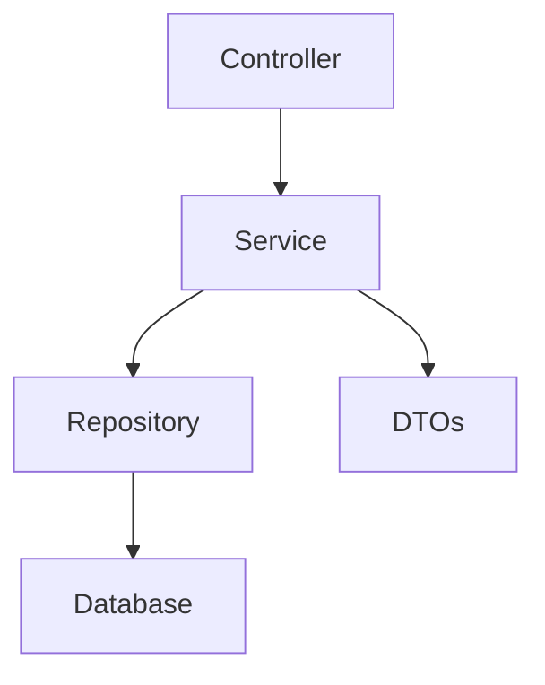

# Interview Hiring System

A robust, enterprise-grade backend service built with Spring Boot for managing job postings, applications, interview scheduling, and evaluations.

## Project Overview

The Interview Hiring System is designed to streamline the recruitment process. It provides a comprehensive set of APIs to allow recruiters to post jobs, candidates to apply, and interviewers to evaluate candidates through a structured workflow.

## Architecture

The system follows a clean, layered architecture to ensure separation of concerns, maintainability, and scalability:

- **Entity Layer**: JPA Entities representing the core data models (`User`, `Job`, `JobApplication`, `Interview`, `Evaluation`).
- **Repository Layer**: Spring Data JPA repositories for database abstraction.
- **Service Layer**: Business logic implementation, including role-based access control and workflow validation.
- **Controller Layer**: RESTful APIs using DTOs for request/response handling.
- **Exception Handling**: Centralized global exception handler for consistent error reporting.



## Role-Based Access Design

The system implements strict role-based access control (RBAC) to ensure data security and process integrity:

| Role | Permissions |
| :--- | :--- |
| **ADMIN** | Full access to all resources; can manage users, jobs, applications, and interviews. |
| **RECRUITER** | Can create and manage jobs; can view applications for their jobs; can schedule interviews. |
| **INTERVIEWER** | Can view assigned interviews; can submit evaluations for completed interviews. |
| **CANDIDATE** | Can view open jobs; can apply to jobs; can view their own application status. |

## Hiring Workflow

1. **Job Creation**: A RECRUITER or ADMIN creates a job posting in the `OPEN` status.
2. **Application**: A CANDIDATE applies to an `OPEN` job. Rules prevent duplicate applications and recruiters applying to their own jobs.
3. **Interview Scheduling**: A RECRUITER or ADMIN schedules an interview for a specific application, assigning an INTERVIEWER.
4. **Interview Completion**: Once an interview is conducted, its status is updated to `COMPLETED`.
5. **Evaluation**: The assigned INTERVIEWER submits an evaluation. Results (PASS/HOLD/FAIL) are automatically calculated based on scores.
6. **Result Processing**: 
   - `PASS` result automatically updates the application status to `SELECTED`.
   - `FAIL` result automatically updates the application status to `REJECTED`.

## How to Run and Test

### Prerequisites
- Java 17
- Maven

### Running the Application
```bash
# Clone the repository
git clone <repository-url>

# Navigate to the backend directory
cd backend

# Run the application
mvn spring-boot:run
```
The server will start at `http://localhost:8080`.

### Running the Frontend
```bash
# Navigate to the frontend directory
cd frontend

# Install dependencies
npm install

# Run the development server
npm run dev
```
The client will be available at `http://localhost:5173`.

### Testing
```bash
# Run all tests
mvn test
```
The project includes:
- **Unit Tests**: Verifying service-layer business rules and logic.
- **WebMvcTests**: Validating controller endpoints and API contracts.
- **Repository Tests**: Ensuring JPA mappings and custom queries work correctly.

### API Documentation (Summary)
- `POST /auth/register`: User registration.
- `POST /auth/login`: User login.
- `GET /jobs`: List all open jobs.
- `POST /jobs/{jobId}/apply`: Candidate application.
- `POST /interviews`: Schedule an interview.
- `POST /evaluations`: Submit an interview evaluation.
